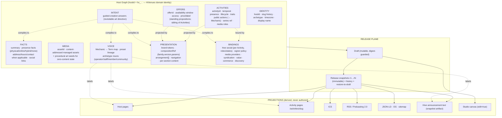

# Candidate C — Phase 0 — Fable lane proposal 0.1.0

Canonical host graph · Voice semantic contract · composition architecture · guided-creation intent model · Activity model · ecosystem seams · migration notes · contradictions for adjudication

```text
PROGRAM = CANDIDATE_C_SYNTHESIS
LANE = FABLE / PRODUCT_MODEL_AND_SEMANTIC_ARCHITECTURE
GOVERNING_CHARTER = #245
EXECUTING_ISSUE = #246
CLASS = PROPOSAL_ONLY
CANDIDATE_C_PRODUCT_CODE = NO
CANONICAL_MAIN_MUTATION = NO
LIVE_HIVE_EFFECT = NONE
PAYMENT_EFFECT = NONE
PRODUCTION_EFFECT = NONE
ASTRA_PHASE0_#247 = NOT_READ_BEFORE_FREEZE
```

## Evidence base and what was not available

Read before writing: #245, #246, #244, #241, #242, PR #243 summary; the mature repository at `main` (`c0877a3`) — in particular `HIVENUES_PRODUCT_DOCTRINE_RECONCILIATION_0_1_0`, `HOST_ACTIVITY_SOCIAL_OBJECT_CONTRACT_0_1_0`, `NEXT_GEN_ACTIVITY_SOURCE_AND_MIGRATION_CONTRACT_0_1_0`, `HIVENUES_ECOSYSTEM_CAPABILITY_INTAKE_0_1_0`, `PM2_SEMANTIC_SITE_DOCUMENT_AND_V1_MIGRATION_CONTRACT_0_1_0`, `src/venue/v3/{source,social-bindings,authoring-transaction}.js`; and my own frozen Candidate A (`greenfield-freeze-v1`, `86b4fa5`).

Not available to me: Candidate B's frozen tree and its findings document. The Project Observatory records cited by the doctrine reconciliation are not in this repository. **Candidate B is represented here only by the charter's "preserve from Candidate B" list.** Where I make claims about Astra's model I say so, and the Astra lane should correct me. I did not open #247.

Terminology: I use **host** for the product concept and keep `venue` where I refer to existing mature identifiers, per the doctrine reconciliation's compatibility-vocabulary rule.

---

## 0. Executive summary of the proposal

1. **One canonical host graph, seven planes.** Identity · Facts · Activities · Media · Voice · Presentation · Bindings, plus an orthogonal **Release** plane (draft/release snapshots and history). Presentation is the only plane that knows about pages. Every public surface — page, Activity page, ICS, RSS, JSON-LD, OG/social card, Hive announcement text — is a *projection* with a declared input set from the graph.
2. **Voice is a typed map from Mechanic to Term.** Mechanics are a closed registry that carries the truthful authority/consequence class (R/P/F/X from the mature contract), value-movement, publicness, and reversibility. Terms are free host language. The graph forbids one Term for two Mechanics of different consequence class; disclosure text derives from the Mechanic, never the Term. Publish review classifies Term edits as presentation and Mechanic remaps as semantic.
3. **Compositions are page-level renderer recipes with a slot contract, not stored layouts.** The graph stores a `compositionRef {familyId, version, params}` and an `arrangement` (ordered section instances). Families declare which section kinds they accept and their accessibility landmark contract; a family test-suite is the accessibility gate. New families are registry + tests, never schema migration.
4. **Guided creation writes an `Intent` record into the graph and compiles it into initial plane values.** The Intent stays; re-running "art direction" produces a reviewable *proposal diff*, never a destructive reset. Same graph, same validators, for guided and granular editing.
5. **Activity = the mature contract, adopted nearly whole**, plus two corrections: public actions carry a Mechanic reference (so Voice and consequence review apply to Activity buttons), and **standing propositions (offers, memberships, menus, standing reservations) are a sibling object `Offer`, not an Activity** — this contradicts #246's wording and is flagged for adjudication.
6. **Ecosystem matrix reconciles Candidate A's ELDR with the mature intake.** Nearly identical conclusions; two differences flagged (Distriator posture; Podping as publish side-effect vs. explicit operator action).
7. **Migration from v3 is a deterministic plane-split**, not a rewrite: identities, slugs, activities, programs→series, media, and social bindings carry over 1:1; `language` becomes a Voice seed; `site.pages/components` become an arrangement under a `legacy-v3` composition family; capabilities become Bindings with unchanged authority semantics.
8. **Nine explicit contradictions/tradeoffs** for the synthesis gate (§9), including where I think #245 over-specifies (Offers inside Activities), under-specifies (what "release" means for a graph with Hive bindings), and where I disagree with my own Candidate A.

---

## 1. Canonical host graph

### 1.1 Principle

> One canonical host graph; many faithful projections.

Candidate A's "the page is the data" was right about *one source* and wrong about *what the source is*: it stored page structure (sections) as the top-level shape, so Activities lived inside a page-shaped document and had no life of their own. The mature v2/v3 envelope had the opposite strength (resources with stable identity, components projecting them) and a weakness Candidate B evidently attacked: page-shaped composition still mixes presentation with domain facts, and the Studio surfaced that mix to operators.

Candidate C should separate **what is true about the host** from **how it is currently shown**, and make both durable, versioned, and diffable — but only the first is *semantic*.

### 1.2 Diagram



### 1.3 The seven planes and what each may know

| Plane | Owns | May reference | Must not know about |
|---|---|---|---|
| Identity | `hostId`, current slug + slug history, archetype, timezone, display name | — | pages, providers |
| Facts | presence facts, summary, contact, links; physical business facts *conditionally* | Media (logo) | pages, Hive |
| Activities | everything in the mature Activity contract §3–§7 + public actions with Mechanic refs | Media, Offers (an Activity may reference an Offer it makes available), Series | pages, provider ids |
| Offers | standing propositions with availability windows | Media | pages |
| Media | assets (content-addressed, dimensions, alt policy), art seeds | — | everything else |
| Voice | Mechanic→Term map, nouns, preset lineage | — | pages (Terms are used *by* projections) |
| Presentation | brand tokens, compositionRef, arrangement, navigation, section-local content | Activities/Offers/Media by id | provider ids, Hive |
| Bindings | Hive social bindings (per Activity, per host), provider bindings, authority policy | Activities, Media | pages |
| Intent | guided-creation answers | — | anything derived |

Two rules that fall out of this table and that Candidate A violated:

- **Presentation is downstream of Activities, never the other way.** A section that shows "upcoming" is a query over Activities, not a container of them. Reordering or deleting a section cannot delete an Activity.
- **Bindings are downstream of Activities and Voice.** A Hive binding cannot exist without the Activity it binds; a Voice Term cannot exist without the Mechanic it names.

### 1.4 Pseudotyped model (sufficient to discuss invariants)

```ts
// ---------- identity ----------
type HostId = `hv_${string}`;          // HiVenues domain identity; never a Hive account
type ActivityId = string;              // lowercase semantic id; never provider id / title / date / URL
type OfferId = string; type AssetId = string; type SeriesId = string; type SectionInstanceId = string;

interface HostGraph {
  kind: 'hivenues-host-graph'; schemaVersion: 4;      // proposed successor of v3 (adjudicate numbering)
  provenance: Provenance;                              // native | v3-migration {digest, contractVersion}
  identity: { hostId: HostId; slug: Slug; slugHistory: Slug[]; archetype: Archetype; timezone: IanaTz; displayName: string };
  facts: Facts;
  activities: Activity[];  offers: Offer[];  series: Series[];
  media: { assets: MediaAsset[]; artSeed: string; artStyle: ArtStyleId };
  voice: Voice;
  presentation: Presentation;
  bindings: Bindings;
  intent: Intent | null;
}

// ---------- facts ----------
type PresenceFacts =
  | { mode: 'physical'; address: Address; geo?: LatLng; hours?: HoursRow[]; phone?: string }
  | { mode: 'online' }
  | { mode: 'hybrid'; address: Address; geo?: LatLng; hours?: HoursRow[] }
  | { mode: 'none' };
interface Facts { summary: string; tagline: string; presence: PresenceFacts; contact: Contact; links: Link[] }

// ---------- activities (mature contract, adopted) ----------
type Temporal = { kind:'OCCURRENCE'; startAt; endAt?: } | { kind:'RELEASE'; releaseAt } | { kind:'WINDOW'; startAt; endAt };
type ActivityPresence = { kind:'PHYSICAL_HOST_DEFAULT' } | { kind:'PHYSICAL_OVERRIDE'; address; geo? }
                      | { kind:'ONLINE'; destinations: Destination[] } | { kind:'HYBRID'; ... } | { kind:'NONE' };
type Lifecycle = 'DRAFT'|'SCHEDULED'|'LIVE'|'COMPLETED'|'POSTPONED'|'CANCELLED';
interface Activity {
  id: ActivityId; slug: Slug; title: string; description?: string;
  noun: ActivityNounId;                       // host-friendly noun from registry (Show, Livestream, Release, …); no renderer fork
  traits: { liveCapability:'none'|'planned'|'available'; mediaCapability:'none'|'promo'|'live'|'replay'|'catalog';
            accessMode:'open'|'ticketed'|'reserved'|'restricted'|'external' };
  temporal: Temporal; presence: ActivityPresence; lifecycle: Lifecycle;
  scheduleHistory: ScheduleFact[];            // prior published schedule facts (material-change provenance)
  access: { note?: string; capacity:'UNSPECIFIED'|'AVAILABLE'|'FULL' };
  items: LineItem[];                          // lineup / tracks / segments — human meaning, not identity
  media: { assetId: AssetId; role:'PROMO'|'LIVE'|'REPLAY'|'CLIP'|'AUDIO'|'GALLERY' }[];
  publicActions: PublicAction[];              // see Voice: every action names a Mechanic
  seriesRef?: SeriesId;  offerRefs?: OfferId[];
}
interface PublicAction { id: string; mechanic: MechanicId; label?: string /* overrides Voice term */; href?: HttpsUrl; params?: Record<string,unknown> }

// ---------- offers (proposed sibling object; see §9 C1) ----------
interface Offer { id: OfferId; title: string; description?: string; availability: { kind:'always' } | { kind:'recurring'; rule: Rrule } | { kind:'window'; startAt; endAt };
                  price?: PriceLabel; access: 'open'|'members'|'purchase'|'reservation'; publicActions: PublicAction[]; media?: AssetId }

// ---------- voice ----------
type MechanicId = 'read' | 'follow' | 'subscribe_community' | 'applaud' | 'reply' | 'post_note'
                | 'rsvp_local' | 'reserve' | 'ticket_external' | 'tip' | 'purchase' | 'support_recurring'
                | 'watch' | 'listen' | 'calendar_subscribe' | 'feed_subscribe' | 'sign_in' | 'capacity_meter';
interface Voice { terms: Partial<Record<MechanicId, Term>>; nouns: { operator; staff; member; community; post; journal }; presetLineage: PresetId[] }
interface Term { label: string; verbPast?: string; iconRef?: string; hint?: string }

// ---------- presentation ----------
interface Presentation {
  brand: { palette: PaletteTokens; type: TypePairingId; shape: ShapeRecipeId; density: DensityRecipeId; surface: SurfaceRecipeId; texture: TextureId };
  composition: { familyId: CompositionFamilyId; version: number; params: unknown /* validated by the family */ };
  arrangement: SectionInstance[];             // ordered; kinds constrained by the family's slot contract
  navigation: NavEntry[];
}
interface SectionInstance { id: SectionInstanceId; kind: SectionKind; enabled: boolean; content: SectionContent /* per-kind schema */;
                            query?: ActivityQuery /* for list-like kinds: which activities/offers */; recipeOverride?: RecipeId }

// ---------- bindings ----------
interface Bindings {
  hive: { account?: HiveAccount; community?: CommunityId; signerPolicy: SignerPolicy } | null;
  activitySocial: HiveSocialBinding[];        // mature v3 social-bindings.js shape: activityId, roles[], state, author/permlink, operationId
  media: ProviderMediaBinding[]; syndication: SyndicationBinding[]; value: ValueBinding[]; commerce: CommerceBinding[]; discovery: DiscoveryBinding[];
  transaction: { state:'disabled' } | { state:'configured'; merchantAccounts: HiveAccount[]; beneficiaryPolicy? };   // separately privileged
}

// ---------- release plane (outside the graph document) ----------
interface HostRecord { hostId: HostId; draft: HostGraph; draftDigest: Sha256; releases: Release[]; }
interface Release { n: number; at: Iso; graph: HostGraph /* immutable */; graphDigest: Sha256; changeSet: ChangeLine[]; note?: string; supersedes?: number }
```

### 1.5 Invariants (the ones worth arguing about)

1. `identity.hostId` and `activity.id` are HiVenues-minted and opaque. No projection, binding, provider id, slug, title, or date participates in them. (Mature contract §1/§3; Candidate A already did this.)
2. A section instance may **reference** Activities/Offers/Media by id or by query; it may never **contain** them. Deleting a section cannot orphan domain objects; deleting an Activity marks referencing queries stale, not broken.
3. Every `PublicAction.mechanic` is a registry Mechanic. A projection may only render a button for an action whose Mechanic is satisfiable by current Bindings (e.g. `tip` requires `bindings.transaction.configured` **or** the wallet-neutral request path); otherwise it renders the Mechanic's declared degraded form.
4. Voice Terms are labels for Mechanics; the Term→disclosure direction is forbidden. The consequence disclosure ("what this actually does") is rendered from `MechanicRegistry[mechanic].disclosure(bindings, params)`.
5. Presentation changes never change a Release's *semantic digest*. Define `semanticDigest = hash(identity, facts, activities, offers, voice.terms→mechanics, bindings)` and `presentationDigest = hash(presentation, media treatments)`. Publish review uses both; feeds and Hive text depend only on the semantic side.
6. Draft mutation is digest-guarded (mature `expectedDraftDigest`); a Release is immutable; restore-to-draft creates a new draft from a Release and records the restore as a history line.
7. Hive social bindings follow the mature state machine (PLANNED → BOUND → DEGRADED → RECONCILIATION_REQUIRED) and are never created by an ordinary draft edit or by publishing a Release. Publishing a Release is a HiVenues-only effect. Socialization is a separate, explicitly signed workflow. (See §9 C3.)
8. A Release may be published with `bindings.hive == null`. `PUBLIC_HOST != MUST_HAVE_HIVE_ACCOUNT`, mirroring the mature `PUBLIC_ACTIVITY != MUST_HAVE_HIVE_POST`.

### 1.6 Projections and their declared inputs

| Projection | Reads | Notes |
|---|---|---|
| Host page(s) | all planes via Presentation | the only projection that reads `presentation` |
| Activity page `/activities/<slug>` | Activity, Facts, Voice, Bindings, Media; **composition family supplies the Activity-page recipe** | canonical route; legacy `/events/<slug>` alias per mature migration contract |
| ICS (host, per-activity) | Activities with temporal, Facts.presence | UID = `${activityId}@${hostId}`; SEQUENCE increments on schedule-fact change so reschedules update rather than duplicate |
| RSS / Podcasting 2.0 | Activities (RELEASE and media-bearing), Facts, syndication bindings | GUID = activityId; podcast namespace only when a syndication binding exists |
| JSON-LD / OG | Facts, Activity, Media | `Event`/`MusicEvent`/`BroadcastEvent`/`MusicRelease` chosen from temporal+traits, not archetype |
| Hive announcement text | Activity snapshot at publication | **a communication artifact**, never parsed back (mature §11.3) |
| Studio canvas | draft, `edit=true` | same renderer, same family |

---

## 2. Voice — semantic translation contract

### 2.1 Founding evidence, restated as a rule

The beer mug / pitcher idea shows that a host may rename *a vote* and *voting capacity* without changing what they are. The contract generalizes that to: **Voice is a presentation-plane map over a semantic-plane registry.**

### 2.2 The Mechanic registry (closed, versioned, not host-editable)

Each Mechanic declares the truth that no Term may alter:

```ts
interface Mechanic {
  id: MechanicId;
  consequenceClass: 'R' | 'P' | 'F' | 'X';        // mature contract §22
  authority: 'none' | 'visitor-posting' | 'visitor-active' | 'host-posting' | 'host-active' | 'service';
  movesValue: boolean; isPublic: boolean; reversible: boolean; onChain: boolean;
  requires: BindingRequirement[];                   // e.g. tip → transaction.configured | walletNeutral
  degraded: 'hide' | 'local-fallback' | 'explain';  // what to do when requirements are unmet
  disclosure: (ctx) => DisclosureText;              // the truthful sentence; parameterized, never host-authored
  conflatesWith: never;                             // see 2.4
}
```

Initial registry (proposal; the Astra lane and Project Lead may prune):

| Mechanic | Class | Value moves | Public | On-chain | Typical Terms (examples only) |
|---|---|---|---|---|---|
| `follow` | P | no | yes | yes | Become a regular · Join the crew · Subscribe to drops |
| `subscribe_community` | P | no | yes | yes | Join the room · Enter the guild |
| `applaud` (vote) | P | no* | yes | yes | Raise a glass · Send a spark · Add to rotation |
| `capacity_meter` (voting power) | R | — | — | — | Your pitcher · Your battery · Needle time |
| `reply` | P | no | yes | yes | Say something back · Leave a note |
| `post_note` (host posts) | P (host) | no | yes | yes | From behind the bar · Dispatches · Liner notes |
| `tip` (transfer, no deliverable) | F | **yes** | yes | yes | Buy the house a round · Fuel the next stream |
| `purchase` (transfer for a deliverable) | F | **yes** | yes | yes | Get the atlas · Buy the record |
| `support_recurring` | F | yes | yes | provider | Keep the lights on |
| `ticket_external` | R (handoff) | provider | provider | no | Reserve a table · Tickets |
| `reserve` | R/P (provider/local) | no | no | no | Book a booth |
| `rsvp_local` | R (local write) | no | no | no | I'm coming · Save me a seat |
| `watch` / `listen` | R | no | no | no | Watch live · Listen |
| `calendar_subscribe` / `feed_subscribe` | R | no | no | no | Get sessions in your calendar |
| `sign_in` | R (session) | no | no | no** | Regulars sign in · Crew sign in |

\* a vote allocates reward-pool influence; the disclosure must say so. \*\* sign-in may involve a signed challenge; it never broadcasts.

### 2.3 What a host may edit

- Any Term (`label`, `verbPast`, `hint`, `iconRef`) for any Mechanic their Bindings make satisfiable.
- Nouns (`operator`, `staff`, `member`, `community`, `post`, `journal`) — a superset of mature `language.operatorNoun/staffRole`.
- Which Mechanic a given `PublicAction` points at — *this is a semantic edit* (see 2.5).

What a host may not do: invent a Mechanic; assign one Term string to two Mechanics of different consequence class; suppress or edit disclosure text; make a P/F/X Mechanic look like R.

### 2.4 Conflation guards (validator rules, not guidance)

| Must never be conflated | Rule |
|---|---|
| `follow` vs `subscribe_community` | distinct Mechanics; both may be offered; a Term used for one is rejected for the other within a host |
| `applaud` (vote) vs `tip` (transfer) | class P vs F; identical Term rejected; the F Mechanic's disclosure always states asset/amount/destination |
| `rsvp_local` vs `purchase`/`ticket_external` | class R vs F/handoff; an Activity may expose both, with distinct Terms; the primary action must be the one whose Mechanic matches `traits.accessMode` |
| `reserve` vs `tip`/`purchase` | a reservation never moves value in HiVenues; if a provider charges, the Mechanic is `ticket_external` |
| `post_note` (host) vs `reply` (visitor) | authority differs (host posting vs visitor posting) |

Validator: `voice.terms` is rejected if `lower(labelA) == lower(labelB)` for Mechanics with different `consequenceClass` or different `movesValue`.

### 2.5 Publish review classification

| Edit | Class | Review line |
|---|---|---|
| Term label change, same Mechanic | presentation | "Visitors will now see 'Cheers' instead of 'Raise a glass'." |
| Noun change | presentation | "Members are now called 'regulars'." |
| PublicAction re-pointed to a Mechanic of the **same** class | semantic-minor | "The 'Tickets' button now hands off to an external ticket page." |
| PublicAction re-pointed across class (e.g. R→F) | **semantic-major**, requires explicit acknowledgement | "'I'm coming' will now **move money** (a 12 HBD transfer). Confirm you mean this." |
| Binding change that makes a Mechanic satisfiable/unsatisfiable | semantic-major | "Turning off payments hides 'Buy the house a round' on 3 activities." |
| Preset applied | expands into the individual lines above | — |

The detector is mechanical: diff `(action.id → mechanic.consequenceClass, movesValue)` before/after; anything crossing class boundaries is major.

### 2.6 Presets

Presets are `{presetId, archetype, terms, nouns}` documents in a registry. Applying one sets `voice.presetLineage += presetId` and copies terms; nothing is hard-coded in projections. Presets ship for the archetypes the reference matrix needs (physical hospitality/venue, creator/performer, label/media, organization, community). A preset may not define Terms for Mechanics its archetype default bindings cannot satisfy (no "Buy a round" preset line without a payments path).

### 2.7 Disclosure placement (charter: "truth at the consequence boundary")

- R Mechanics: disclosure available on demand (tooltip/`title`/expander).
- P Mechanics: disclosure visible in the confirmation sheet before signing.
- F Mechanics: disclosure visible **and** asset/amount/destination repeated on the confirm control itself.
- X Mechanics: never visitor-facing.

---

## 3. Structural compositions

### 3.1 Composition families vs themes vs recipes

| Level | Where | Candidate A had | Mature v3 has | Candidate C proposal |
|---|---|---|---|---|
| Tokens (palette, type, shape, density, surface, texture) | Presentation.brand | palette+type+roundness+texture | four recipe ids + colours | union of both, as tokens |
| Section/component recipe | per section instance | none (composition decided) | `recipeId` + responsive overrides per component | keep, but **family-owned defaults**; `recipeOverride` is optional |
| **Composition family** (page-level structure: hero treatment, list treatment, rhythm, nav pattern, mobile bar, Activity-page recipe) | Presentation.composition | 3 families in code | none (page = ordered components) | **new; the differentiator** |

A *theme* changes tokens. A *family* changes what the page **is**: a poster bill, a magazine feature, a catalog wall. Both are renderer code; only their references and params are data.

### 3.2 What is data, what is renderer recipe

Data (in the graph): `composition {familyId, version, params}`, `arrangement[]` (section kinds, order, enabled, per-kind content, queries), `navigation`, brand tokens, optional `recipeOverride` per section.

Renderer recipe (in code, versioned): the family's slot contract, its per-slot recipes, its responsive behaviour, its Activity-page layout, its accessibility landmark plan, its art-engine defaults.

`params` is opaque to the schema and validated by the family (`family.validateParams(params)`), so a family may add knobs without a graph migration. A family version bump with incompatible params must ship a `migrateParams(old)`; the graph schema does not change.

### 3.3 Slot contract — how reordering stays sane

Each family declares:

```ts
interface CompositionFamily {
  id; version;
  slots: { kind: SectionKind; cardinality: '1' | '0..1' | '0..n'; pinned?: 'top' | 'bottom'; recipes: RecipeId[] }[];
  fallback: (kind: SectionKind) => RecipeId;   // for kinds it has no bespoke treatment for
  activityPage: RecipeId;                       // the family's Activity-page recipe
  landmarks: LandmarkPlan;                      // header/nav/main/sections/footer, heading order
  mobile: { stickyAction: boolean; navPattern: 'sheet' | 'bar' };
  art: { style: ArtStyleId; heroTreatment: … };
}
```

Reordering is constrained by `pinned` (hero top, contact/footer bottom) and cardinality; everything else is free. Two hosts with the same section order but different families still differ structurally because the family, not the order, decides hierarchy, rhythm, and hero/list treatment. This is how Candidate A avoided "same template, different colour" while keeping the Studio's Page panel a simple list.

Sections the family lacks a bespoke recipe for render through `fallback` (a generic, accessible treatment), so switching families never loses content — it may look plainer until the family gains a recipe. Publish review names this: "The 'Hours' section has no special treatment in Catalog; it will use the standard one."

### 3.4 Accessibility and testability

- Every family must pass the same **landmark/heading contract test**: one `banner`, one `navigation`, one `main`, each section a labelled region, headings monotone, focus order = DOM order, mobile sticky bar not obscuring focus targets. This test runs against a fixture graph per archetype (physical, creator, media) — the reference matrix from the doctrine reconciliation §8.
- Per-family **golden screenshots** at 1440/820/390 for the same fixtures are release evidence (charter: "CI passing is never sufficient").
- Contrast is validated at token level (Candidate A's warning becomes a validator that blocks release below 4.5:1 for `text/canvas`, warns for accents).

### 3.5 Adding a family

Registry entry + slot contract + recipes + landmark test + golden fixtures. No schema change, no migration, no Studio change (the Look panel reads the registry). Removing a family requires a `deprecatedTo` family so existing hosts re-project, with a review line.

### 3.6 Relationship to mature component recipes

Mature `hero-poster`, `list-poster-rows`, `hero-editorial-split`, `list-card-grid`, etc. are exactly the *slot recipes* a family would own. Proposal: the initial families are assembled from those recipes plus Candidate A's (poster/editorial/catalog), and a fourth `legacy-v3` family whose slot contract is "any component order, any allowed recipe" so migrated hosts render identically on day one. (See §9 C4 on whether `legacy-v3` should be permanent.)

---

## 4. Guided creation — intent model

### 4.1 Principle

Guided creation is **art direction, not configuration**. It gathers a small number of high-level answers, compiles them into a full, good-looking, *honest* first draft (procedural art, safe Voice, sensible arrangement, no fabricated facts), and stores the answers so the operator can revisit direction later.

### 4.2 The Intent record (in the graph)

```ts
interface Intent {
  version: 1;
  archetype: 'venue' | 'creator' | 'label' | 'organization' | 'community' | 'festival' | 'other';
  presence: 'physical' | 'online' | 'hybrid';
  visitorJobs: ('attend' | 'watch' | 'listen' | 'reserve' | 'buy' | 'support' | 'join' | 'learn')[];   // ordered by importance
  feel: { energy: 0..1; warmth: 0..1; density: 0..1; era: 'classic' | 'modern' | 'raw' | 'refined' };
  vocabularyDirection: 'plain' | 'playful' | 'insider' | 'formal';  // + optional free-text "how do you talk to regulars?"
  existing: { hiveAccount?: string; videoChannel?: {provider; id}; feed?: url; ticketing?: url; reservations?: url|phone; social?: Link[] };
  ecosystem: { wantsHiveCommunity: boolean; acceptsHbd: boolean; wantsDiscovery: boolean; wantsPodcastFeed: boolean };
  answeredAt: Iso; revisedAt?: Iso;
}
```

Seven questions, most with pictures rather than words (feel is chosen from mood boards generated by the art engine; vocabulary direction is chosen from example sentences).

### 4.3 Compilation: Intent → graph (deterministic, pure)

```text
compile(intent, registries) →
  identity.archetype                    ← archetype
  facts.presence                        ← presence (+ address fields left empty, flagged "needed before release" when physical)
  voice                                 ← preset(archetype) ⊕ vocabularyDirection modifier (e.g. 'insider' picks the more idiomatic term variants)
  presentation.brand                    ← feel → token search: energy→contrast/accent saturation, warmth→hue family, density→density recipe, era→type pairing
  presentation.composition              ← archetype × visitorJobs[0..1] → family (venue+attend→poster; creator+watch→editorial; label+listen/buy→catalog; organization+learn/support→editorial; community+join→catalog)
  presentation.arrangement              ← family default slots, ordered by visitorJobs (e.g. 'support' early if it's job #1)
  media.artSeed/artStyle                ← feel + family
  bindings                              ← existing.* → provider bindings in 'planned' state; ecosystem.* → toggles
  activities/offers                     ← none fabricated; one DRAFT placeholder per top visitor job with an honest empty state
```

Properties: (a) total — every Intent yields a valid graph; (b) pure — same Intent, same registries → same graph (so it is testable and the Look panel can show "what would change"); (c) **non-fabricating** — no fake facts, prices, dates, media or accounts.

### 4.4 Revisiting art direction without rerunning setup

`redirect(intent', currentDraft)` = `diff(compile(intent'), compile(intent))` applied as a **proposal** to the current draft, section by section, with the operator accepting or rejecting each line. Anything the operator has hand-edited since (tracked by comparing draft to `compile(intent)`) is marked "you changed this" and defaults to *keep*. This satisfies the charter's "revisit high-level art direction later without destructively rerunning setup" and the "same canonical graph" rule.

### 4.5 Mapping table

| Intent input | Graph plane(s) | Later editable in |
|---|---|---|
| archetype | identity, voice (preset), presentation.composition | Details, Voice, Look |
| presence | facts.presence, arrangement (map/hours slots) | Details |
| visitorJobs | arrangement order, primary actions on placeholder activities, mobile sticky action | Page, Activities |
| feel | brand tokens, art style, family choice tie-break | Look |
| vocabularyDirection | voice term variants | Voice |
| existing.* | bindings (planned), watch/journal/feed sections enabled | Connect |
| ecosystem.* | bindings toggles | Connect |

---

## 5. Hive ecosystem semantics — reconciled matrix

Reconciled against the mature intake's classifications; differences flagged in §9.

| Capability class | Domain meaning HiVenues owns | Seam | Likely adapters (2026) | Degradation | Must never become identity | Status |
|---|---|---|---|---|---|---|
| Hive account / L1 social identity | "the host's people"; membership = follow/subscribe | `SocialGraphProvider` (read) | Hive API nodes (bridge/condenser), Hivemind | community/roster sections explain; sign-in offered but not required | Hive account ≠ hostId | **core external primitive** |
| Posts / votes / replies | journal, applaud, reply Mechanics | `ContentProvider` (read), `SigningProvider` (write, P) | Hive API + Aioha (Keychain/HiveAuth/HiveSigner/Ledger/PeakVault) | journal degrades; gestures fall back to sign-in/explain | author/permlink ≠ activityId | **core external primitive** |
| Activity social root | the durable conversation of an Activity | `activitySocial` bindings + mature state machine | same | DEGRADED state renders facts without discussion | permlink ≠ activityId | **adapt behind seam** |
| Signer abstraction | consequence review, authority class | `SigningProvider` = intent→validate→review→authority→adapter→broadcast→reconcile | Aioha as adapter family | provider absent → not listed; failure → local, explained | provider session ≠ identity | **adapt behind seam** |
| HBD/HIVE transfer (tip/purchase) | value-for-value, purchases | `PaymentProvider` (F) + wallet-neutral request | Aioha transfer; `hive://` URIs; QR | no wallet → request URI; payments off → explain | invoice/memo ≠ identity | **adapt behind seam; per-host optional** |
| V4V Lightning bridge | podcast value blocks | `PaymentProvider` extension | v4v.app | absent → no `podcast:value` block | — | **optional interop, deferred to media hosts** |
| Distriator / SpendHBD | cashback handoff for physical hosts taking HBD | `CommerceProvider` | Distriator | absent → payment still works | business/claim id ≠ hostId | **optional interop** (see §9 C6) |
| SPK / 3Speak | Activity media roles (promo/live/replay/catalog) | `MediaProvider` | 3Speak, SPK, generic URL/RSS | watch section degrades; schedule intact | CID/video id ≠ activityId | **adapt behind seam** |
| Podping | "tell the world the feed changed" | `Notifier` | podping-hivewriter (service authority) | failure logged, retry offered; never blocks release | — | **optional interop** (see §9 C7) |
| RSS / Podcasting 2.0 | account-less follow; episode syndication | projection | — | static | GUID ≠ activityId | **core standard** |
| ICS | account-less calendar | projection | — | static | UID ≠ activityId (but stably derived) | **core standard** |
| WorldMapPin | discovery for physical hosts/activities | `DiscoveryProvider` | WorldMapPin | absent → directions still from own facts | pin id ≠ location truth | **optional interop** |
| Hive communities | community-scoped journal, subscribe Mechanic | `SocialGraphProvider` | Hivemind communities | disabled → follow-only membership | community id ≠ hostId | **adapt; per-host optional** (mature `capabilities.community`) |
| Hive Engine | — | — | — | — | — | **defer** |
| HoneyComb / Breakaway | pattern evidence only | — | — | — | — | **reference only** |
| Magi | — | — | — | — | — | **defer**; re-open conditions per intake §11 |

Authority boundaries carried unchanged from the mature contract: R/P/F/X classes; transaction capability separately privileged; service signer (Podping, delegated posting) is X to configure and P to use; no ambient authority.

---

## 6. Activity model

### 6.1 Adopt the mature contract

Candidate A's Activity was a flat record with a `kind` enum, `start/end/allDay`, `online` boolean, free-form actions, and no identity discipline around bindings or reschedules. The mature `HOST_ACTIVITY_SOCIAL_OBJECT_CONTRACT_0_1_0` and v3 source already solve the hard parts correctly. Candidate C should adopt, verbatim in meaning: identity rules (§1, §3.1); discriminated temporal (§3.3); presence (§3.4, plus a `PHYSICAL_OVERRIDE` for activities at a different physical place than the host — Candidate A's label listening session needed this); lifecycle (§5); reschedule ≠ new activity with schedule history (§6); series (§7); socialization states and primary-root rules (§8–§10); source facts vs Hive content (§11); post-publication edit classes (§12); cancellation-first (§13); media roles (§14); observations vs status (§15); idempotent publication (§24); no fake atomicity (§25).

### 6.2 Corrections and additions

1. **Public actions name Mechanics.** v3 `publicActions.role ∈ {INFO, TICKETS, RSVP, RESERVE, WATCH, LISTEN, CALENDAR}` becomes `mechanic ∈ MechanicRegistry`, adding `tip`/`purchase` (F) so support and buy buttons on an Activity page are governed by the same Voice/disclosure/consequence rules as everywhere else. `LEGACY_EXTERNAL` maps to `ticket_external`/`watch`/`listen` by href heuristics *at migration time only*, never inferred at runtime (mature §14 "semantic non-inference").
2. **Traits, not archetype forks** (mature §4), with a bounded `noun` registry (Show, Livestream, Workshop, Meetup, Premiere, Release, AMA, Event, Drop, Session). Nouns drive authoring language, defaults and validation (a Release must have `temporal.kind = RELEASE`), never renderer forks.
3. **Line items** (`items[]`) for lineup/tracks/segments — human meaning, Candidate A had it, mature source lacks it.
4. **Canonical Activity pages are family-rendered.** `/activities/<slug>` uses the family's `activityPage` recipe; the family may not omit essential facts and primary action above media (the S9.4 RB4 finding).
5. **`scheduleHistory`** is a first-class array so ICS `SEQUENCE`, publish review ("Calendar subscribers see the new time"), and the `SOCIAL_NOTICE_NEEDED` derivation all read one place.
6. **Offers are not Activities.** See §9 C1. A standing proposition (happy hour, membership, menu, standing table reservation, merch) has availability rather than a moment, is never LIVE/COMPLETED, and never gets a social root of its own. Forcing it into Activity would either dilute lifecycle semantics or grow a second enum. `Offer` is a small sibling object; an Activity may reference Offers it makes available (a show may offer a table package).

### 6.3 Activity page projection contract

Above the fold: title, noun, temporal (human + machine), presence/destination, lifecycle badge (LIVE/POSTPONED/CANCELLED loud; SCHEDULED quiet), primary action (Mechanic-governed), add-to-calendar. Then: description, items, media by role (promo before live before replay, unless LIVE), the Hive discussion when `SOCIAL_ROOT_BOUND` (degraded notice when DEGRADED), secondary actions, series link, related activities. JSON-LD derived from temporal+traits.

---

## 7. Ecosystem capability / seam matrix — see §5. Seams summary

`SocialGraphProvider` · `ContentProvider` · `SigningProvider` · `PaymentProvider` · `CommerceProvider` · `MediaProvider` · `Notifier` · `DiscoveryProvider`. Each returns `Result<T>`; each has a declared degraded rendering per Mechanic; none may mint identity; only `SigningProvider` and `Notifier` have side effects, and both go through persisted intent (mature §24).

---

## 8. Migration notes from mature HiVenues (v3 → host graph)

Deterministic, receipt-producing, reversible (v3 preserved byte-exact; one active mutable authority), per the mature migration contract's own discipline.

| v3 | Host graph | Notes |
|---|---|---|
| `venue.id` | `identity.hostId` | preserved exactly; `VENUE_ID_PATTERN` accepted as a legacy id form (no `hv_` re-minting) |
| `venue.displayName` | `identity.displayName` | — |
| `venue.business` (nullable) | `facts.presence` `physical` w/ address/phone/hours(string→rows best-effort, original kept in `note`) or `none` | `mapUrl`/`websiteUrl` → `facts.links` |
| `venue.language {operatorNoun, staffRole}` | `voice.nouns.operator/staff` + archetype preset for the rest | Terms for Mechanics default from preset; review line "Voice defaults applied" |
| `media.assets` | `media.assets` | identical; art seed generated |
| `resources.activities` | `activities` | 1:1; `publicActions.role` → `mechanic` (INFO→`read`, TICKETS→`ticket_external`, RSVP→`rsvp_local`, RESERVE→`reserve`, WATCH/LISTEN→same, CALENDAR→dropped (projection provides it), LEGACY_EXTERNAL→`ticket_external`); `managedMedia` roles kept; `seriesRef.program` → `seriesRef` |
| `resources.programs` | `series` (+ each program's own window kept as a `WINDOW` Activity if it was publicly listed) | adjudicate: programs currently carry their own schedule; series in the new model are groupings |
| `resources.menus` | `offers[]` (one Offer per menu item, grouped by menu/section) **or** a `catalog` section content | see §9 C1 |
| `resources.equipment` | `offers[]` with `availability` + state, or a facts sub-collection | low priority; adjudicate |
| `activityBindings.hiveSocial` | `bindings.activitySocial` | shape preserved (roles, states, operationId) |
| `site.brand.design` | `presentation.brand` tokens | recipe ids map 1:1 (typography/density/shape/surface); colours → palette tokens |
| `site.pages[].components[]` | `presentation.composition = legacy-v3@1`; `arrangement` = components in order with `recipeOverride = recipeId`, `responsive` kept in `params` | renders identically on day one |
| `site.navigation` | `presentation.navigation` | page targets → section anchors or additional pages (multi-page adjudication §9 C8) |
| `capabilities.community` | `bindings.hive.community` + `subscribe_community` Mechanic satisfiable | authority unchanged |
| `capabilities.transaction` | `bindings.transaction` | unchanged; separately privileged |
| `provenance` | `provenance {origin:'v3-migration', sourceDigest, contractVersion}` | receipt |
| routes `/events/<slug>` | alias map retained | mature rule |

Non-goals of migration: renaming `venue` identifiers; changing accepted public URLs; inferring Mechanics from prose; creating Hive objects.

---

## 9. Contradictions and tradeoffs for Project Lead adjudication

**C1 — Offers inside Activities (#246 §6) vs. Offer as a sibling object (this proposal §6.2.6).** #246 says Activities must represent "events, streams, releases, offers, reservations/ticketing opportunities". I propose *reservation/ticketing opportunities* are `PublicAction`s on an Activity, and *offers* are a distinct durable object. Cost: one more object kind and one more Studio list. Benefit: Activity lifecycle, socialization and ICS stay meaningful; menus/equipment have a natural home. Alternative if rejected: `temporal.kind = 'STANDING'` with `lifecycle` restricted to DRAFT/SCHEDULED/CANCELLED and socialization forbidden — I think that is the worse graph.

**C2 — "Release" vs the mature "Apply/Save workspace checkpoint" model.** #245 asks to preserve Candidate B's draft/release snapshots, release history and restore-to-draft, and the mature Studio's proposal/preview → Apply/Discard → Save. These are three tiers (proposal → draft → release). I propose keeping all three but naming only two for operators: *Apply* is invisible micro-commit with undo; *Publish* creates a Release. Candidate A had no proposal tier (autosaved draft) and Astra's exact semantics are unknown to me. Adjudicate whether the proposal/preview tier is operator-visible.

**C3 — What "publish" touches.** I propose a Release is a HiVenues-only effect: it never creates or edits Hive objects, never Podpings without an explicit per-host opt-in, never signs. Socialization is a separate workflow with its own review. #245's "release review → publish" diagram could be read as one step; the mature §12/§13 ("the application must not silently choose") supports my reading. Adjudicate explicitly because it determines whether the publish review needs a signer at all.

**C4 — `legacy-v3` composition family: permanent or transitional.** Permanent guarantees byte-faithful migrated rendering forever but keeps a "no family" path alive that undercuts differentiation. Transitional (deprecate after every reference host has been re-directed through Intent) is cleaner but forces work on live hosts. I lean transitional with a `deprecatedTo` rule.

**C5 — Single page + Activity pages vs. multi-page hosts.** Candidate A was single-page + sheets; mature v3 has `pages[]` (up to 24). The composition model above is single-page-first with Activity pages as the second route family. Multi-page can be added as `arrangement` per page under the same family, but every additional page weakens the "poster/feature/wall" identity of a family. Adjudicate: allow 1..3 pages per family with family-declared page slots, or keep single-page + Activity pages for Candidate C v1.

**C6 — Distriator posture.** Mature intake: `OPTIONAL_INTEROP`. Candidate A: optional, off by default, a per-host toggle. Same class, but I add a constraint the intake does not: the toggle must be unavailable unless `bindings.transaction.configured` and `facts.presence ∈ {physical, hybrid}` — no cashback affordance on a creator page. Minor; flagged because it is a validator rule, not a preference.

**C7 — Podping as a publish side-effect.** Candidate A fired a (mock) Podping on every publish of a media host. The mature contract makes Podping an X-to-configure/P-to-use service-authority action. I now agree with the mature position and *reverse my Candidate A behaviour*: Podping is opt-in, uses service authority, is journaled, and never runs implicitly. Recorded so the ELDR comparison does not treat the Candidate A behaviour as a proposal.

**C8 — Hive account optionality vs. "Hive-native social identity is a foundational product dimension".** Doctrine reconciliation §3 says foundational; also says representability ≠ qualification. I keep `bindings.hive` nullable (preconnection, synthetic, offline, migration) but propose the **qualification** rule: a host may not be marked *reference-qualified* without a Hive binding, and the Studio's "Everything is live" state should show a persistent, calm "not yet connected to your people" line rather than pretending completeness. This is a product-qualification stance, not a schema one.

**C9 — Where I disagree with my own Candidate A.** (a) Sections contained activities → replaced by queries. (b) `kind` enum on Activity → traits + noun registry. (c) Autosave-only drafting → Apply tier with digest guard (mature). (d) Studio "pulse" read the dry-run ledger by string-matching account names → any operator analytics must come from journaled, typed events. (e) Implicit Podping (C7). (f) The Voice map had no consequence classes; Terms could in principle collide across classes → conflation guards (§2.4).

**C10 — HTMX.** Not my lane, but the model above has an opinion: the graph, Releases, projections, Activity pages, feeds, publish review and the Intent compiler are all server-side/pure and HTMX-friendly. The parts that genuinely want client state are the canvas (inline edit, selection, device switch) and the Look panel's live token preview. A vertical slice that renders the canvas server-side with HTMX swaps per section and keeps only selection/inline-edit in JS is plausible; the Voice and Publish-review surfaces are pure HTML forms. Recorded as input to the Project Lead lane, not as a decision.

---

## 10. Explicit non-goals

- No Candidate C code, schema files, migrations, or Studio changes in this lane.
- No renaming of accepted `venue` identifiers, routes, or provenance files.
- No selection of an executable signer/media/payment dependency (Aioha etc. named as *likely adapters* only).
- No visual design of the Studio (Astra lane) and no HTMX experiment plan (Project Lead lane).
- No claim about Candidate B's model beyond the charter's list; corrections welcome.
- No live Hive, payment, provider, DNS/VPS, or production effect; none occurred while preparing this.

---

## Appendix A — Minimal invariant checklist (for the synthesis gate)

```text
I1  hostId, activityId, offerId are HiVenues-minted; no projection/binding/provider value participates
I2  sections reference domain objects by id/query; never contain them
I3  every visitor-facing action names a registry Mechanic; disclosure derives from the Mechanic
I4  one Term may not name two Mechanics of different consequence class or movesValue
I5  semanticDigest excludes presentation; feeds/JSON-LD/Hive text depend only on semantic planes
I6  draft edits are digest-guarded; Releases are immutable; restore creates a new draft + history line
I7  publishing a Release has no Hive/provider side effect; socialization is separately signed and journaled
I8  activity identity survives reschedule/postpone/cancel/provider change; schedule history is kept
I9  presence facts are conditional; no archetype requires an address
I10 Intent compiles purely and non-fabricatingly; re-direction is a proposal diff, never a reset
I11 composition families are code with a slot contract; params opaque to schema; landmark tests gate release
I12 optional provider failure degrades one Mechanic/section, never the page, never identity
```

## Appendix B — Candidate A evidence pointers

Frozen at tag `greenfield-freeze-v1` (`86b4fa5`): `src/core/spec.ts` (HostSpec, Voice), `src/core/changes.ts` (publish-review lines), `src/renderer/compositions.tsx` (three families), `src/core/art.ts` (procedural art), `src/core/hive/seams.ts` + `mock.ts` (seams, dry-run receipts), `docs/ELDR.md`. This proposal supersedes the model there; the evidence of *effect* (screenshots, e2e) stands.
