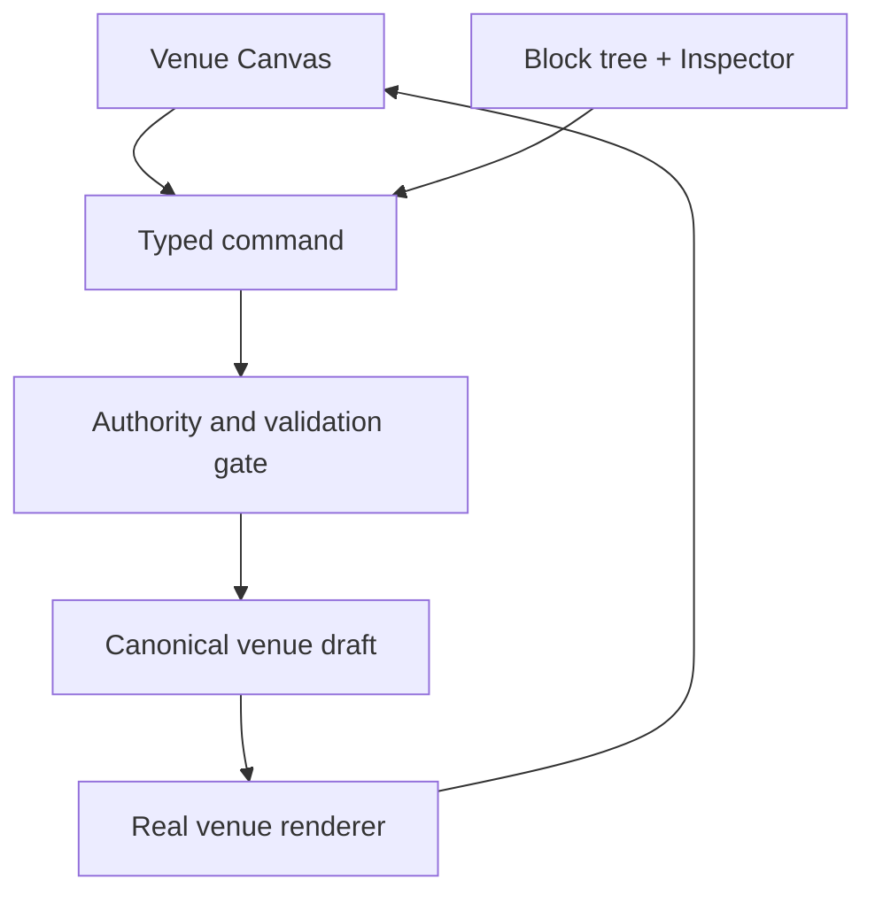

# Post-v1 visual-builder comparative design study 0.1.0

## Status and authority

| Field | Value |
| --- | --- |
| Tracking issue | `#133` — Research modern visual-builder UX signals for the post-v1 HiVenues Studio |
| Study date | 2026-09-03 |
| Canonical base commit | `2037371e207be94f57aca7e7b26ae6c688262adb` |
| Canonical base tree | `6997f8e16e81692b3de4171b6b07754263d130ba` |
| Product baseline | HiVenues `v1.0.0` |
| Scope | Comparative research and product-direction conclusions only |
| Implementation authorization | **No** |
| Production, deployment, identity, payment, or venue effects | **None** |

This study satisfies the research scope of issue `#133`. It is a design input, not permission to change the Studio, schema, generated venue sites, deployment path, or any real venue record.

## Executive decision

The recommended post-v1 direction is a **native Venue Canvas backed by a semantic block tree and a contextual inspector**.

HiVenues should adopt the immediacy of direct selection, clear insertion points, visible responsive previews, and local history found in modern visual builders. It should not adopt their generic page-builder authority model. The typed HiVenues venue document remains the sole source of authoring truth; the visual surface emits typed, validated commands through the existing authority gate.

The product direction is therefore:

1. Make the real generated venue page the primary visual canvas.
2. Represent its editable structure as venue-specific semantic blocks, not arbitrary DOM nodes.
3. Keep a synchronized, ordered block tree for overview, insertion, and accessible reordering.
4. Show only relevant controls in a contextual inspector, with safe inline editing for simple content.
5. Preserve explicit draft and workspace-save boundaries; never imply that a visual change was published.
6. Use responsive layout recipes and guardrails rather than separate free-form desktop and mobile compositions.
7. Preserve direct source authoring and all current source, deployment, safety, accessibility, provenance, and identity contracts.
8. Continue to qualify authoring experience and generated-site quality as separate review tracks.

This is a native evolution of the current stack. The study does not select or authorize Webflow, Wix, Squarespace, Framer, Shopify, GrapesJS, or another third-party builder runtime.

## Research question

How can the post-v1 HiVenues Studio feel modern, visual, and direct without turning a constrained venue-authoring system into a generic website builder or weakening its authority and safety model?

## Method and evidence boundaries

The study uses four evidence classes:

| Evidence class | Use | Limit |
| --- | --- | --- |
| Canonical HiVenues source | Establishes current authoring, rendering, and authority behavior | Describes the shipped baseline, not future permission |
| Deterministic HiVenues screenshots | Shows the current Studio and generated-site presentation | A visual observation is not, by itself, an implementation requirement |
| Official builder and standards documentation | Establishes documented product behavior and interaction patterns | Products change; access date is 2026-09-03 |
| Community reports | Identifies recurring confusion worth testing | Anecdotal and non-authoritative; never the sole basis for a conclusion |

Throughout this document:

- **Observation** means behavior or evidence directly present in a cited source or the canonical baseline.
- **Conclusion** means a HiVenues-specific design judgment derived from multiple observations and existing contracts.
- **Requirement candidate** means a proposed condition for a separately authorized implementation issue. It is not active scope.

## Current HiVenues baseline

### Authority and safety

The current Studio is an adapter over the canonical domain authoring model. Its preview state, local project JSON, exported HTML/CSS, and UI component state are not independent sources of truth. The real venue renderer supplies preview output, direct source mode remains viable, and edits must pass the same authority gate before becoming an accepted workspace draft.

The current editable surface intentionally exposes bounded venue facts, copy, semantic theme values, and structured venue collections. It does not expose arbitrary HTML, CSS, scripts, DOM trees, or an unconstrained page tree. Real reference-client identity is protected, and synthetic fixtures remain the proper surface for identity-edit behavior.

These are product strengths to preserve, not limitations to route around.

### Interaction and presentation

The v1 Studio is a polished, form-first workflow organized around four steps — Brand, Page, Details, and Review — plus semantic editing tabs. It provides explicit draft, undo-preview, and workspace-save actions. On desktop, an editor column and real-renderer preview share the workspace. On mobile, the interface stacks and offers an Edit/Preview switch.

The deterministic visual artifact from canonical CI run `573` (artifact `9913117552`, SHA-256 `d2957c52ebc3aa3e42a3f392c870659240e69bc8ea4cb902e5d232a96270958b`) supports two distinct observations:

- **Track A — Studio:** the surface is clear and safe, but the intro, status, global actions, steps, tabs, and workspace tools consume substantial space before the editable content. The model remains form-centric rather than canvas-centric, particularly on mobile.
- **Track B — generated site:** the generated venue page is visually strong and coherent. The central post-v1 opportunity is authoring interaction and spatial hierarchy, not replacement of the venue renderer.

### Baseline diagnosis

The v1 interaction model answers “which form field changes this venue property?” It does not yet answer “what on this page can I change, add, move, or inspect?” with the immediacy expected of a modern visual builder.

The post-v1 design should close that gap without broadening authority.

### Canonical internal evidence reviewed

All paths in this table were reviewed at the base commit named in the status block.

| Evidence | Role in this study |
| --- | --- |
| `src/venue/turnkey-studio.js` and `src/venue/turnkey-workspace.js` | Shipped Studio composition, actions, responsive workspace, and project persistence surface |
| `src/venue/reference/source-authoring-surface-core.js` and `src/venue/native-authoring-surface.js` | Form-first editing surface and native authoring behavior |
| `src/venue/visual-authoring-session.js` and `src/venue/authoring.js` | Preview/draft boundaries, typed edits, and authority behavior |
| `docs/HV5_VENUE_AUTHORING_CONTRACT_FOUNDATION_ACCEPTANCE_0_1_0.md` | Canonical source-authoring contract and accepted authority boundary |
| `docs/HV6_OPERATOR_VISUAL_AUTHORING_ADAPTER_FOUNDATION_ACCEPTANCE_0_1_0.md` | Accepted visual-adapter boundary |
| `docs/HV6_OPERATOR_VISUAL_AUTHORING_ADAPTER_FOUNDATION_TECHNOLOGY_SELECTION_0_1_0.md` | Prior native-versus-embedded-builder evaluation |
| `test/hv6-native-authoring-surface.test.js`, `test/hv6-visual-authoring-session.test.js`, and `test/turnkey-release.test.js` | Existing behavior and release assertions |
| CI run `573`, artifact `9913117552`, manifest paths `issue-132-turnkey-review/track-a-studio-{desktop,mobile}.png` and `track-b-real-renderer-output.png` | Deterministic current Studio and generated-site visual evidence |

## Comparator synthesis

| Reference | Strong signal | Adapt for HiVenues | Do not import |
| --- | --- | --- | --- |
| Webflow | Canvas-dominant workspace, synchronized Navigator, contextual styling, components, breakpoints, variables, backups, audit tools ([WF-1]–[WF-10]) | Direct selection, synchronized semantic tree, contextual focus, tokens, visible responsive state | DOM/CSS-class mental model, inheritance density, unrestricted layout primitives |
| Wix Studio | Inspector follows selection, breakpoint controls, responsive inheritance, pervasive save/preview cues ([WIX-1]–[WIX-8]) | Contextual inspector, intentional viewport switching, visible save state | Docking/unit complexity, breakpoint proliferation, ambiguous cascading overrides |
| Squarespace Fluid Engine | Visible grid, snapping/alignment feedback, direct resize, block insertion, approachable site styles ([SQ-1]–[SQ-7]) | Strong manipulation feedback, bounded block presets, approachable global styling | Free placement, independent mobile composition, session-only recovery assumptions |
| Framer | Fast canvas interaction, layers, stacks, exposed component properties, reusable sections, version history ([FR-1]–[FR-7]) | Auto-layout recipes, intentional component properties, quick actions, recoverable versions | Absolute-positioning bias, designer-tool terminology, variant/breakpoint ambiguity |
| Shopify theme editor | Semantic sections and blocks, bounded settings, preview inspector, device preview ([SH-1]–[SH-7]) | Domain components plus constrained settings and canvas-to-inspector mapping | Commerce information architecture, schema conventions copied without venue-domain fit |

Shopify is the closest architectural precedent because its visual editor manipulates semantic, constrained components rather than treating arbitrary page markup as the primary authoring surface. HiVenues should still derive its own venue-domain language and retain its existing authority model.

## 1. Workspace anatomy and chrome hierarchy

### Observation

Webflow explicitly makes the canvas the largest interface region and distributes global, structural, and contextual tools around it ([WF-1], [WF-2], [WF-3], [WF-4]). Wix Studio similarly places selection-specific controls in an Inspector ([WIX-1]). Shopify's preview inspector connects a clicked preview element to its corresponding settings ([SH-1], [SH-2]).

The current HiVenues Studio gives persistent, high-area treatment to descriptive material and workspace import/save tools. That is useful during onboarding but competes with the actual authoring task on every visit.

### Conclusion

The future desktop anatomy should be:

| Region | Purpose | Default behavior |
| --- | --- | --- |
| Compact top bar | Venue identity, viewport, undo/redo, save state, preview | Persistent; no publish/deploy control |
| Collapsible left rail | Pages, ordered sections, Add | Structural overview and accessible navigation |
| Primary canvas | Real rendered venue page | Largest region; direct selection and insertion affordances |
| Collapsible right inspector | Controls for current selection | Opens on selection; progressive disclosure |
| Status channel | Validation, save, and command outcomes | Visible and programmatically announced without shifting layout |

The large introductory content should become first-run guidance or contextual help. Workspace import/save utilities should move into a compact project menu or drawer. These changes reclaim the primary viewport without removing capability.

On narrow screens, the Studio should use deliberate **Edit** and **Preview** modes rather than a compressed three-pane layout. The selected block and its principal action should remain visible near the top; precision dragging should not be required.

## 2. Canvas–panel balance

### Observation

The strongest comparators reserve most working space for the artifact and reveal detail on demand. Webflow couples direct canvas work to contextual panels and a synchronized hierarchy ([WF-1]–[WF-4]). Wix Inspector groups controls for the selected element rather than presenting every possible field simultaneously ([WIX-1]).

### Conclusion

On a typical desktop viewport, the canvas should receive roughly 68–75% of usable width when one rail is open. The left rail should target approximately 240–280 px and the inspector approximately 320–360 px, both collapsible. These are starting hypotheses for prototype testing, not frozen implementation values.

Rules for balance:

- Never require both side panels to remain open.
- Keep the selected block visible when the inspector opens.
- Preserve canvas zoom and pan state across panel changes.
- Prefer overlays or drawers for short, transient tasks; do not stack permanent toolbars.
- Use full-page settings only for genuinely global operations such as venue-wide theme tokens.
- At narrow widths, replace simultaneous panels with a mode switch and a dismissible bottom sheet or full-screen editor.

The canvas must use the real renderer. A duplicate “editor renderer” would reintroduce drift between Studio and generated-site quality.

## 3. Component insertion and discovery

### Observation

Webflow exposes elements and reusable components; Framer uses an Insert panel and reusable component assets; Squarespace provides Add Block and pre-built section patterns; Shopify exposes sections and blocks whose available settings are constrained by the theme ([WF-6], [FR-4], [FR-7], [SQ-1], [SH-3], [SH-4]).

Generic libraries optimize for breadth. A venue operator instead benefits from recognizing the task they want to complete.

### Conclusion

Insertion should use a searchable, venue-oriented gallery available from the left rail, command palette, empty states, and between-section “Add” affordances. Search synonyms should map ordinary language to the same semantic block; for example, “hours,” “when open,” and “schedule” can lead to Hours & Location.

An exploratory block vocabulary is:

| Family | Candidate blocks | Guardrail |
| --- | --- | --- |
| Identity | Venue hero, location and hours, primary call to action | Identity-bound values remain protected |
| Programming | Events, classes/programs, schedule, announcements | Structured facts remain typed |
| Experience | Gallery, amenities/equipment, menu/services, testimonials | Media requires alt/crop treatment; no raw embeds by default |
| Community | Community pulse, social proof, pathways, contact | Link and consent rules remain enforced |
| Structure | Navigation, section divider, footer | Cannot create an arbitrary document tree |

Each gallery item should provide a thumbnail or real miniature preview, a one-line purpose statement, and any prerequisite. Recommended blocks may use venue data and page context, but they must remain suggestions, never silent insertions.

Blocks are semantic product concepts, not wrappers around arbitrary HTML. Their inventory and typed payloads require a separately reviewed domain contract before implementation.

## 4. Selection and contextual editing

### Observation

Webflow synchronizes canvas selection and Navigator state ([WF-2], [WF-4]). Wix Inspector changes with the selected element ([WIX-1]). Shopify's preview inspector maps preview selection back to a setting group ([SH-1], [SH-2]). Framer components can expose only intended instance properties ([FR-4]).

### Conclusion

Every editable rendered region should map to a stable semantic component instance identifier. Selection should synchronize among:

- the canvas outline and label;
- the semantic block tree;
- the contextual inspector heading and controls;
- the accessibility selection state; and
- a shareable diagnostic reference for test evidence, not a public URL capability.

Clicking visible copy may offer a safe inline editor. Structured facts, media, theme, validation, and multi-field settings belong in the inspector. Inline and inspector changes must dispatch the same typed commands and receive the same validation result.

Selection feedback must not rely on color alone. It should combine outline, label, focus state, and inspector context. Escape should move predictably from inline editing to block selection to no selection. The canvas must not trap keyboard focus.

## 5. Drag, drop, and reordering feedback

### Observation

Webflow and Shopify support hierarchical or section reordering, while Squarespace emphasizes a visible grid and alignment indicators during manipulation ([WF-2], [WF-4], [SH-2], [SQ-1]–[SQ-3]). WCAG 2.2 requires a non-drag single-pointer alternative for functionality that uses dragging ([A11Y-1], [A11Y-2]). The ARIA Authoring Practices rearrangeable-list example demonstrates explicit Move Up and Move Down controls ([A11Y-3]).

### Conclusion

Reordering feedback should show:

- the exact destination before commit;
- a compact ghost of the semantic block, not a screenshot of the whole section;
- valid and invalid destinations;
- auto-scroll near canvas and tree edges;
- an announced completion or rejection state; and
- a reversible command entry.

Every drag action must have two alternatives: visible Move Up/Move Down controls and a “Move to…” action that selects a destination. Both must work with keyboard and single-pointer input. Precision dragging cannot be the only way to complete a task.

The model should reorder semantic sections within allowed page regions. It should not expose unconstrained pixel coordinates. Components whose position is required for identity, navigation, accessibility, or policy may be locked or have a restricted destination set, with the reason shown.

## 6. Responsive editing and preview

### Observation

Webflow exposes breakpoints and cascading styles ([WF-5]). Wix Studio provides default and custom breakpoints, with larger-breakpoint changes cascading to smaller ones ([WIX-2], [WIX-3]). Squarespace permits independent mobile arrangement and sizing ([SQ-1]–[SQ-3]). Framer promotes stacks, grids, and responsive components ([FR-1]–[FR-5]). Shopify's theme editor previews multiple device sizes ([SH-2]).

Community discussions repeatedly report confusion when responsive inheritance, docking, variants, or separate mobile layouts are difficult to predict ([C-WIX-1], [C-WIX-2], [C-FR-1], [C-FR-2], [C-SQ-1], [C-SQ-2]). Those reports are anecdotal, but they identify risks that prototype testing should target.

### Conclusion

HiVenues should expose Desktop, Tablet, and Mobile previews, plus free-width inspection for testing. The authoring model should use responsive **layout recipes**—for example hero media placement, card grid density, and stack direction—rather than separate free-form compositions.

Default rules:

1. Content and semantic order are shared across viewports.
2. Layout decisions cascade from the primary viewport to smaller viewports when safe.
3. A limited override is always visibly attributed to its viewport.
4. Reset-to-inherited is available beside every override.
5. The system warns about overflow, unreadable line length, clipped media, undersized targets, and order divergence.
6. Mobile preview is a first-class review state, not an afterthought.

Independent desktop and mobile page trees should be rejected. They raise drift, maintenance, and accessibility risk and obscure which representation is authoritative.

## 7. History, undo, and save cues

### Observation

Webflow documents autosave and recoverable backups ([WF-7]). Wix Studio autosaves changes, shows saved state, and provides Site History, while its editor does not provide a full visible undo-history log ([WIX-4], [WIX-5], [WIX-6]). Squarespace supports undo/redo primarily within the current editing session and explicitly notes exclusions ([SQ-4]). Framer exposes file version history ([FR-6]).

The current HiVenues model deliberately separates preview changes, retained draft changes, and workspace save. That boundary prevents an attractive interface from silently gaining authority.

### Conclusion

The future Studio should make five states explicit:

| State | Meaning | User cue |
| --- | --- | --- |
| Session command history | Reversible edits in the open session | Undo/redo with last-action label |
| Recoverable local cache | Crash/reload recovery only | “Recovered unsaved session” notice |
| Applied draft | Validated candidate in the Studio draft | “Applied to draft” state |
| Workspace save | Persisted through the canonical workspace authority path | Timestamped “Saved to workspace” state |
| Deployment | Separate operational process outside this editor | No publish control in the authoring chrome |

Autosave may protect session recovery, but it must never be labeled simply “Saved” if the canonical workspace has not been updated. Undo/redo must operate on typed commands and surface rejected, non-reversible, or externally changed states explicitly. A future version-history design should restore a canonical venue-document revision, not an opaque visual-editor project.

## 8. Design-system and theme controls

### Observation

Webflow combines variables, classes, components, and templates into its design-system model ([WF-3], [WF-8], [WF-9]). Wix and Squarespace expose site-wide colors and typography ([WIX-7], [WIX-8], [SQ-5], [SQ-6]). Framer uses reusable sections, components, and layout systems ([FR-2]–[FR-5]).

The current HiVenues authoring model already uses semantic theme fields such as canvas, surface, border, text, muted text, accent, and accent hover.

### Conclusion

The future Theme surface should deepen semantic tokens rather than expose raw CSS. Candidate groups are:

- color roles, including canvas, surface, border, text, muted text, accent, and interaction states;
- type roles, including display, heading, body, label, and metadata;
- spacing and density scales;
- radius and elevation scales;
- media treatment, including crop and focal point; and
- approved section recipes.

Global token edits should show affected components in the canvas and run contrast checks before application. Per-block exceptions should be rare, named, and resettable. Custom CSS, arbitrary classes, unrestricted units, and script injection should remain outside the default product surface.

Templates and styles should be HiVenues-authored venue starting points, not imported page-builder templates. Reference clients must preserve their identities; examples and identity-edit tests should use synthetic fixtures.

## 9. Accessibility and keyboard operation

### Observation

WCAG 2.2 adds requirements for alternatives to dragging and a minimum target-size criterion ([A11Y-1], [A11Y-2]). The ARIA Authoring Practices show keyboard-operable rearrangement controls ([A11Y-3]). WCAG guidance also requires programmatic status messages and visible focus treatment ([A11Y-4], [A11Y-5]). Webflow's Audit panel surfaces issues such as alternative text, heading levels, link text, and duplicate IDs ([WF-10]).

### Conclusion

Accessibility is part of the authoring contract and the generated-site contract. They must be evaluated separately.

Authoring-surface requirement candidates:

- Full operation by keyboard, including selection, insertion, editing, reordering, viewport switching, undo, and save.
- Non-drag alternatives for every drag interaction.
- A logical focus order among top bar, tree, canvas, and inspector.
- Visible focus with sufficient contrast and area; selected and focused states remain distinguishable.
- Controls at least 44 × 44 CSS px where practical, retaining the current stronger internal target above WCAG's minimum.
- Programmatic names, roles, states, relationships, and live status for validation and save outcomes.
- No keyboard trap inside canvas or inline editor.
- Reduced-motion behavior for transitions, drag ghosts, and canvas zoom.

Generated-site guardrails:

- Logical semantic order independent of visual placement.
- Valid heading hierarchy and landmark structure.
- Required alt text or an explicit decorative-media decision.
- Link-purpose and accessible-name checks.
- Token-level contrast validation.
- No responsive override that creates focus-order or reading-order divergence.

Automated checks are necessary but not sufficient. Separately authorized implementation work should include keyboard walkthroughs, screen-reader spot checks, responsive visual review, and automated accessibility scans on deterministically activated states.

## 10. Beginner confidence versus expert power

### Observation

Squarespace and Shopify emphasize bounded blocks and curated settings ([SQ-1], [SH-1]–[SH-5]). Webflow and Framer expose deeper structural, styling, and shortcut-driven power ([WF-1]–[WF-9], [FR-1]–[FR-7]). Wix groups a wide range of element properties in the contextual Inspector ([WIX-1]).

### Conclusion

HiVenues should use one authority model with progressive disclosure, not separate “simple” and “expert” editors.

Beginner-facing defaults:

- Start from recognizable venue tasks and recommended section recipes.
- Show content before layout controls.
- Use plain-language labels and preview the result before application.
- Keep one primary action per state.
- Explain validation next to the affected content and preserve the user's input after rejection.
- Offer safe empty-state suggestions and reversible actions.

Expert accelerators:

- Command palette and documented shortcuts.
- Searchable block tree and quick navigation.
- Token editor with usage visibility.
- Multi-select or batch operations only where their semantics are unambiguous.
- Copy/paste of compatible semantic blocks with provenance preserved.
- Precise diagnostic details behind disclosure controls.

Expert mode may increase efficiency and visibility. It must not grant raw-code authority, bypass validation, expand identity permissions, or add deployment effects.

## 11. Patterns not to import

| Pattern | Why HiVenues rejects it |
| --- | --- |
| Arbitrary DOM/page-tree authority | Conflicts with the typed venue document and creates renderer/editor drift |
| Raw HTML, CSS, script, or unrestricted embed editing | Expands the security and review surface beyond the product need |
| Pixel-freeform layout as the primary model | Produces fragile responsive behavior and weak semantic order |
| Independent desktop and mobile compositions | Creates divergence, duplicated maintenance, and accessibility ambiguity |
| Breakpoint proliferation and hidden cascading overrides | Makes causes and ownership of responsive changes difficult to understand |
| CSS-class and inheritance machinery as the default mental model | Optimizes for professional web designers rather than venue operators |
| Huge persistent side panels and stacked toolbars | Shrinks the artifact and recreates the v1 above-the-fold hierarchy problem |
| Drag-only placement or reordering | Excludes keyboard and non-drag pointer operation |
| Ambiguous “Saved” or autosave language | Can misrepresent session recovery as canonical acceptance or deployment |
| A Publish button in Studio | Collapses authoring and operational authority that must remain separate |
| Silent AI layout or content changes | Weakens intent, reviewability, provenance, and deterministic evidence |
| Editor-only rendering | Lets the visual builder and generated venue site disagree |
| Copying a competitor's information architecture or visual language | Fails the reference-not-imitation requirement and dilutes venue-domain fit |
| Permanent onboarding prose in the main workspace | Consumes task space after it stops being useful |

Community reports about responsive surprises in Framer, Wix Studio, and Squarespace reinforce several of these risks, but the rejections rest on HiVenues authority, accessibility, and maintainability contracts—not on anecdote alone.

## 12. HiVenues-native interaction principles

1. **The venue document is the authority.** The canvas, tree, inspector, local cache, and exports are projections or adapters.
2. **Render the real venue.** Authoring preview and generated output use the same renderer and semantic inputs.
3. **Manipulate venue meaning, not markup.** Operators add and arrange Hero, Events, Hours, Gallery, and other domain blocks—not divs.
4. **Make the page the workspace.** The canvas receives visual priority; chrome appears in proportion to its current value.
5. **Selection has one identity.** Canvas, tree, inspector, focus, validation, and evidence point to the same stable block instance.
6. **Directness stays bounded.** Safe copy may be edited inline; structured facts and complex settings remain typed and contextual.
7. **Responsive means coherent adaptation.** Shared content and order, curated recipes, visible inheritance, limited overrides.
8. **Every manipulation has an accessible alternative.** Dragging accelerates; it never gates completion.
9. **Save language names the boundary.** Session recovery, applied draft, workspace save, and deployment are never conflated.
10. **Design choices use semantic tokens.** Venue-wide roles and constrained recipes replace arbitrary CSS controls.
11. **Power comes from speed, not more authority.** Shortcuts, search, and batch tools accelerate the same validated commands.
12. **Evidence follows the contracts.** Studio UX and generated-site quality remain separate, deterministic review tracks.

## Proposed conceptual model

The loop is intentional: the UI never mutates rendered markup as an independent truth. It requests a typed domain change, the authority layer accepts or rejects it, and the real renderer projects the resulting draft.

### Candidate authoring command families

| Family | Examples | Required behavior |
| --- | --- | --- |
| Content | Set heading, update hours, add event | Typed validation; protected facts enforced |
| Structure | Insert block, move block, remove block | Stable identifiers; allowed-region rules; accessible alternatives |
| Presentation | Set theme token, choose layout recipe, set focal point | Semantic values; contrast and overflow checks |
| Session | Undo, redo, recover, discard | Deterministic command history; explicit boundary language |
| Persistence | Apply to draft, save to workspace | Exact authority path; clear success and rejection states |

## Schema and architecture prerequisites

The current v1 model should not be stretched implicitly to simulate a generic block builder. Before implementation, a separate issue should decide whether the canonical domain document needs:

- stable semantic component instance identifiers;
- explicitly ordered, typed section collections;
- allowed placement and cardinality rules;
- versioned command and inverse-command semantics;
- responsive recipe and override representation;
- theme-token extension and migration behavior;
- provenance for inserted, duplicated, and template-derived blocks; and
- backward-compatible parsing for existing venue documents and direct source mode.

Any schema change must preserve existing source documents, real-renderer equivalence, identity protection, and deterministic evidence. Editor project state must not become a competing authority.

## Separately authorized prototype sequence

This sequence is a recommendation for future issues, not active work:

1. **Contract prototype:** stable block identity, typed order, command/inverse-command behavior, and backward compatibility using synthetic fixtures.
2. **Read-only interaction prototype:** canvas selection synchronized with the semantic tree and contextual inspector; no new mutation authority.
3. **Bounded mutation prototype:** insert, edit, move, and remove a small set of venue blocks through the existing authority gate.
4. **Responsive prototype:** layout recipes, viewport inheritance, reset, overflow warnings, and deterministic mobile/desktop review states.
5. **History and persistence prototype:** session undo/redo, crash recovery, Apply to draft, and Save to workspace with unambiguous cues.
6. **Qualification:** separate Studio and generated-site tracks covering desktop, mobile, keyboard, accessibility, source compatibility, and exact identity binding.

Each step should be independently reversible and reviewed before broadening the next surface.

## Requirement candidates for an implementation issue

A future implementation issue should not be accepted without all of the following:

- The canonical venue document remains the only authoring authority.
- Direct source mode remains viable and round-trippable.
- The real renderer drives canvas output.
- Stable semantic selection synchronizes canvas, tree, inspector, focus, and diagnostics.
- Every insert, edit, reorder, and remove operation is a typed, validated, reversible command where reversal is semantically possible.
- Reordering has drag, Move Up/Down, and Move to alternatives.
- Desktop, tablet, and mobile states are explicit; content and semantic order do not fork.
- Session recovery, applied draft, workspace save, and deployment are visibly distinct.
- The Studio includes no publish, production, key, payment, or venue-onboarding effect.
- Theme controls use semantic tokens and guardrails rather than raw CSS.
- Reference-client identity remains protected and identity mutations use synthetic fixtures.
- Keyboard, screen-reader, focus, target-size, contrast, overflow, and reduced-motion checks are included.
- Studio and generated-site visual evidence are captured separately from deterministic activation states.
- Existing v1 venue documents and tests remain compatible or receive an explicitly approved migration.

## Decision register

| Decision | Result | Confidence | Reason |
| --- | --- | --- | --- |
| Primary interaction model | Venue Canvas + semantic tree + contextual inspector | High | Converges directness with the current authority model |
| Runtime strategy | Native current-stack evolution | High | Avoids a competing editor authority and duplicate renderer |
| Structural unit | Typed venue block | High | Matches operator intent and preserves domain constraints |
| Responsive model | Shared semantics + recipes + limited visible overrides | High | Reduces divergence while retaining useful control |
| Persistence language | Explicit session/draft/workspace/deployment states | High | Preserves the existing safety boundary |
| Free-form layout/CSS | Rejected by default | High | Disproportionate safety, accessibility, and usability cost |
| Exact panel dimensions | Prototype hypothesis only | Medium | Must be tested across real viewport and content states |
| Initial block inventory | Exploratory | Medium | Requires domain/schema review and operator testing |
| Multi-select and block copy/paste | Deferred expert accelerators | Medium | Useful only after command and provenance semantics are stable |

## Research limitations and validation needs

- Official documentation describes supported behavior, not the complete lived experience of every product.
- Community reports are self-selected and cannot establish prevalence.
- This study did not conduct new moderated usability sessions with venue operators.
- Proposed dimensions and block inventory are hypotheses, not measured optima.
- No interactive HiVenues prototype was created under this issue.
- No schema migration, third-party runtime, or AI authoring behavior was evaluated in implementation.

The next learning step should therefore be a synthetic-fixture prototype with task-based observation, not a production feature build.

## Source register

All external sources were accessed 2026-09-03. Official product and standards sources are primary evidence. Community links are included only as anecdotal risk signals.

### Webflow — official

- [WF-1] [Intro to Webflow][WF-1]
- [WF-2] [Webflow canvas overview][WF-2]
- [WF-3] [Style panel overview][WF-3]
- [WF-4] [Navigator][WF-4]
- [WF-5] [Breakpoints overview][WF-5]
- [WF-6] [Components overview][WF-6]
- [WF-7] [Save and restore backups][WF-7]
- [WF-8] [Variables][WF-8]
- [WF-9] [Using a design system in Webflow][WF-9]
- [WF-10] [Intro to the Audit panel][WF-10]

### Wix Studio — official

- [WIX-1] [Using the Inspector panel][WIX-1]
- [WIX-2] [Managing breakpoints][WIX-2]
- [WIX-3] [Building a responsive site][WIX-3]
- [WIX-4] [Keyboard shortcuts][WIX-4]
- [WIX-5] [Saving, previewing, and publishing][WIX-5]
- [WIX-6] [Request: viewing the undo history log][WIX-6]
- [WIX-7] [Working with site colors][WIX-7]
- [WIX-8] [About site styles][WIX-8]

### Squarespace — official

- [SQ-1] [Edit your site with Fluid Engine][SQ-1]
- [SQ-2] [Resizing blocks][SQ-2]
- [SQ-3] [Moving blocks to customize layouts][SQ-3]
- [SQ-4] [Using undo and redo in Squarespace][SQ-4]
- [SQ-5] [Make style changes to your site][SQ-5]
- [SQ-6] [Redesign or restart your site][SQ-6]
- [SQ-7] [Squarespace keyboard shortcuts and tips][SQ-7]

### Framer — official

- [FR-1] [Framer Fundamentals][FR-1]
- [FR-2] [Stacks and relative positioning][FR-2]
- [FR-3] [Layout grids][FR-3]
- [FR-4] [Components][FR-4]
- [FR-5] [Setting up a Framer site for scale][FR-5]
- [FR-6] [Revert to a previous working version][FR-6]
- [FR-7] [The Insert panel][FR-7]

### Shopify — official

- [SH-1] [Theme editor best practices][SH-1]
- [SH-2] [Theme editor features overview][SH-2]
- [SH-3] [Theme architecture][SH-3]
- [SH-4] [Sections][SH-4]
- [SH-5] [Blocks][SH-5]
- [SH-6] [Theme settings][SH-6]
- [SH-7] [Block best practices][SH-7]

### Accessibility standards and guidance

- [A11Y-1] [Understanding SC 2.5.7: Dragging Movements][A11Y-1]
- [A11Y-2] [Web Content Accessibility Guidelines 2.2][A11Y-2]
- [A11Y-3] [Rearrangeable listbox example][A11Y-3]
- [A11Y-4] [Understanding SC 4.1.3: Status Messages][A11Y-4]
- [A11Y-5] [Understanding SC 2.4.13: Focus Appearance][A11Y-5]

### Community risk signals — non-authoritative

- [C-FR-1] [Framer breakpoint discussion][C-FR-1]
- [C-FR-2] [Framer component/breakpoint discussion][C-FR-2]
- [C-WIX-1] [Wix Studio breakpoint/resizing discussion][C-WIX-1]
- [C-WIX-2] [Wix Studio responsive-layout discussion][C-WIX-2]
- [C-SQ-1] [Squarespace Fluid Engine layout discussion][C-SQ-1]
- [C-SQ-2] [Squarespace editor/published-layout discussion][C-SQ-2]

[WF-1]: https://help.webflow.com/hc/en-us/articles/33961260162323-Intro-to-Webflow
[WF-2]: https://help.webflow.com/hc/en-us/articles/33961319255059-Webflow-canvas-overview
[WF-3]: https://help.webflow.com/hc/en-us/articles/33961362040723-Style-panel-overview
[WF-4]: https://help.webflow.com/hc/en-us/articles/33961320786451-Navigator
[WF-5]: https://help.webflow.com/hc/en-us/articles/33961300305811-Breakpoints-overview
[WF-6]: https://help.webflow.com/hc/en-us/articles/33961303934611-Components-overview
[WF-7]: https://help.webflow.com/hc/en-us/articles/33961244069395-Save-and-restore-backups
[WF-8]: https://help.webflow.com/hc/en-us/articles/33961268146323-Variables
[WF-9]: https://help.webflow.com/hc/en-us/articles/41959932025235-Using-a-design-system-in-Webflow
[WF-10]: https://help.webflow.com/hc/en-us/articles/33961313088531-Intro-to-the-Audit-panel
[WIX-1]: https://support.wix.com/en/article/studio-editor-using-the-inspector-panel
[WIX-2]: https://support.wix.com/en/article/studio-editor-managing-breakpoints
[WIX-3]: https://support.wix.com/en/article/studio-editor-building-a-responsive-site
[WIX-4]: https://support.wix.com/en/article/studio-editor-keyboard-shortcuts
[WIX-5]: https://support.wix.com/en/article/studio-editor-saving-previewing-and-publishing-your-site
[WIX-6]: https://support.wix.com/en/article/studio-editor-request-viewing-the-undo-history-log
[WIX-7]: https://support.wix.com/en/article/studio-editor-working-with-site-colors
[WIX-8]: https://support.wix.com/en/article/studio-editor-about-site-styles
[SQ-1]: https://support.squarespace.com/hc/en-us/articles/6421525446541-Edit-your-site-with-Fluid-Engine
[SQ-2]: https://support.squarespace.com/hc/en-us/articles/206543647-Resizing-blocks
[SQ-3]: https://support.squarespace.com/hc/en-us/articles/206543987-Moving-blocks-to-customize-layouts
[SQ-4]: https://support.squarespace.com/hc/en-us/articles/4403167416461-Using-undo-and-redo-in-Squarespace
[SQ-5]: https://support.squarespace.com/hc/en-us/articles/205815788-Make-style-changes-to-your-site
[SQ-6]: https://support.squarespace.com/hc/en-us/articles/205815378-Redesign-or-restart-your-site
[SQ-7]: https://support.squarespace.com/hc/en-us/articles/214491097-Squarespace-keyboard-shortcuts-and-tips
[FR-1]: https://www.framer.com/academy/courses/fundamentals
[FR-2]: https://www.framer.com/academy/lessons/framer-fundamentals-stacks-and-relative-positioning
[FR-3]: https://www.framer.com/help/articles/layout-grids/
[FR-4]: https://www.framer.com/academy/lessons/framer-fundamentals-components
[FR-5]: https://www.framer.com/help/articles/setting-up-your-framer-site-for-scale/
[FR-6]: https://www.framer.com/help/articles/how-can-i-revert-to-a-previous-working-version-of-my-file/
[FR-7]: https://www.framer.com/academy/lessons/framer-fundamentals-the-insert-panel
[SH-1]: https://shopify.dev/docs/storefronts/themes/best-practices/editor
[SH-2]: https://help.shopify.com/en/manual/online-store/themes/customizing-themes/theme-editor/features-overview
[SH-3]: https://shopify.dev/docs/storefronts/themes/architecture
[SH-4]: https://shopify.dev/docs/storefronts/themes/architecture/sections
[SH-5]: https://shopify.dev/docs/storefronts/themes/architecture/blocks
[SH-6]: https://shopify.dev/docs/storefronts/themes/architecture/settings
[SH-7]: https://shopify.dev/docs/storefronts/themes/architecture/blocks/best-practices
[A11Y-1]: https://www.w3.org/WAI/WCAG22/Understanding/dragging-movements
[A11Y-2]: https://www.w3.org/TR/WCAG22/
[A11Y-3]: https://www.w3.org/WAI/ARIA/apg/patterns/listbox/examples/listbox-rearrangeable/
[A11Y-4]: https://www.w3.org/WAI/WCAG21/Understanding/status-messages
[A11Y-5]: https://www.w3.org/WAI/WCAG22/Understanding/focus-appearance.html
[C-FR-1]: https://www.reddit.com/r/framer/comments/1ipizqi/having_the_worst_time_with_breakpoints/
[C-FR-2]: https://www.reddit.com/r/framer/comments/1roe4j7/can_you_edit_framer_components_differently_for/
[C-WIX-1]: https://www.reddit.com/r/WIX/comments/1g9ota1/issue_with_breakpoints_and_resizing/
[C-WIX-2]: https://www.reddit.com/r/WIX/comments/1aq5mwg/wix_studio_is_ruining_my_life/
[C-SQ-1]: https://www.reddit.com/r/squarespace/comments/1ud4fsi/anyone_else_struggling_with_severe_layout_issues/
[C-SQ-2]: https://www.reddit.com/r/squarespace/comments/1u7yiqh/published_looks_so_different_to_editor_layout/
